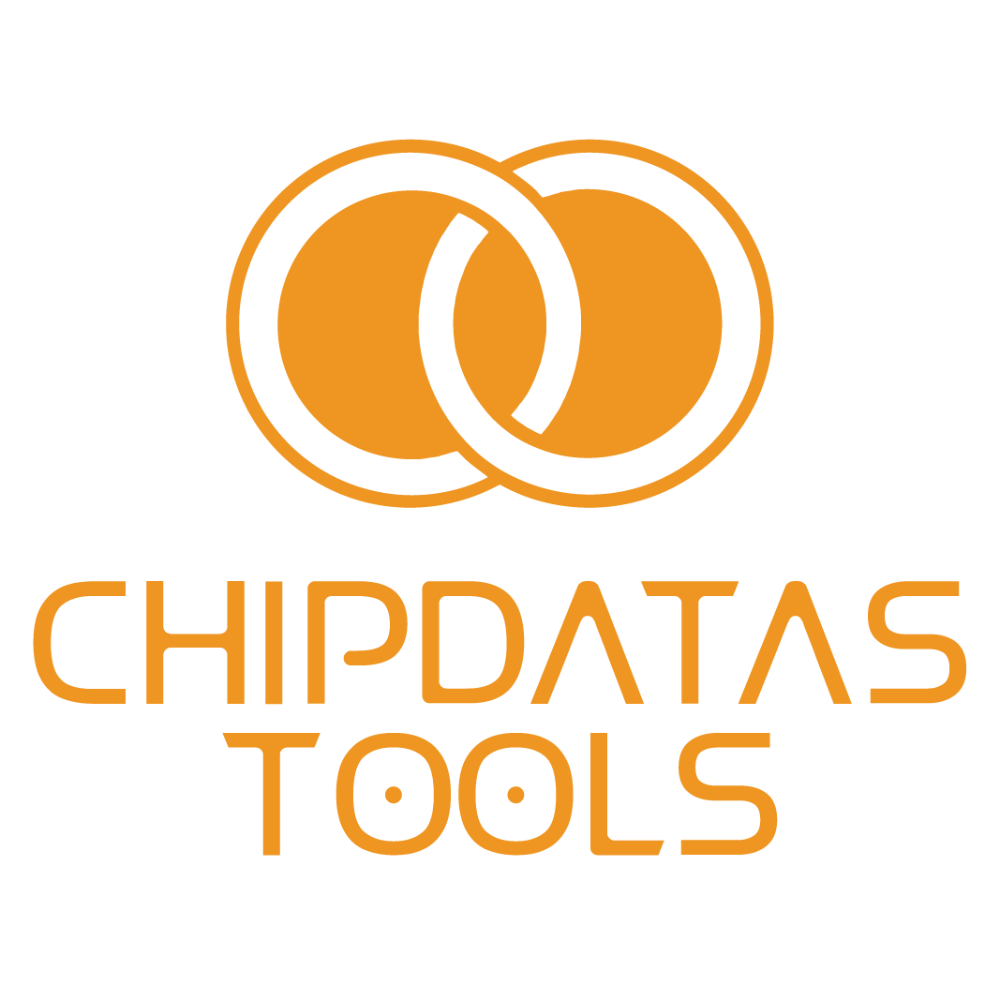

# Chipdatas Tools

Chipdatas Tools – a versatile program designed for electronic component calculations and explanations.

Key Features:

1. Cross-platform compatibility: Chipdatas Tools is available for Windows, Mac, and Linux operating systems, providing a seamless experience for users across different platforms.
2. Extensive component calculations: With Chipdatas Tools, users gain access to a wide range of calculations and explanations related to electronic components. The program offers over a hundred tools and functions to assist users in various electronic projects.

Designed to cater to the needs of electronics enthusiasts, engineers, and hobbyists alike, Chipdatas Tools simplifies complex calculations and provides detailed explanations for different electronic components. Whether you’re calculating resistor values, analyzing transistor circuits, or solving capacitor-related equations, this program is a valuable resource.

Experience the convenience and efficiency of Chipdatas Tools as it brings together a comprehensive collection of electronic component calculations and explanations in a user-friendly platform, accessible across various operating systems. Boost your electronics projects with the power of this versatile software.

Download Here：  https://tool.chipdatas.com
